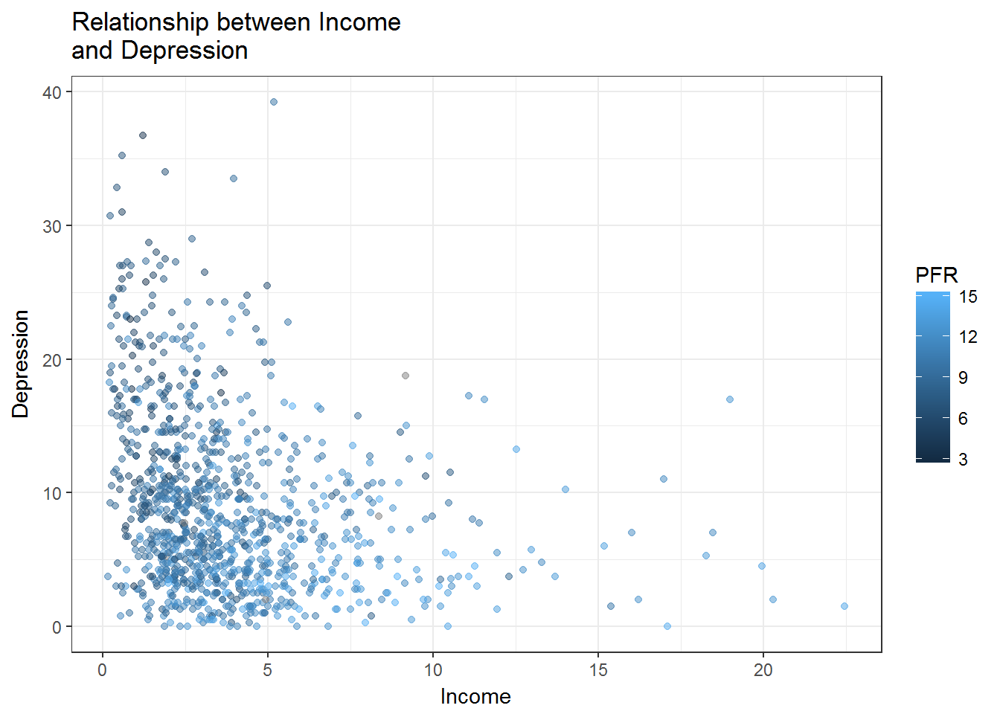

```r
# Plot Depression against Income
# Print plot
library(gapminder)
library(tidyverse)
library(ggplot2)

ggplot(ewb_reduced, aes(y=MEANDEP, x=MEANINC, by=MEANPFR)) +
	geom_point(aes(col=MEANPFR), alpha=.5) +
	theme_bw() +
	labs(x="Income", y="Depression", title="Relationship between Income\nand Depression",col="PFR")
```

```
## Warning: Removed 322 rows containing missing values (geom_point).
```



```r
ggsave("ewb_plot.jpg", height = 4, width = 4)
```

```
## Warning: Removed 322 rows containing missing values (geom_point).
```

```r
#rmarkdown::render('C:/Users/Wade/OneDrive/2017 Fall Semester/Exploratory Statistics/Stat545-hw7-wade-wade/script3.R', clean=FALSE)
```

<b>Move to HW 7 Master Script:</b>

<a href=https://github.com/wswade2/Stat545-hw7-wade-wade/blob/master/master_script.html>HW 7 Master Script</a>

